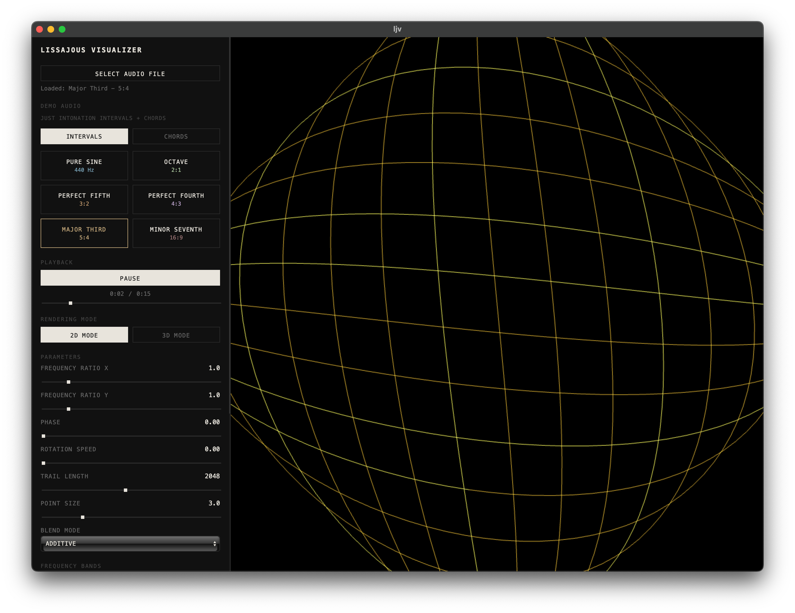

# LJV - Lissajous Visualizer



A beautiful real-time music visualizer that creates mesmerizing Lissajous curves from your audio files. Built with modern web technologies and packaged as a native desktop application.


https://github.com/user-attachments/assets/51c64a37-9208-4988-943e-affd418333a1

*Note that the demo audio is scuffed because I'm recording the playback. Also, if the video doesn't work, [try YouTube](https://youtu.be/b0tc8OLiZp8)*

Music in the demo is [Razihel - Love U](http://ncs.io/loveu) provided by NoCopyrightSounds

## What are Lissajous Curves?

Lissajous curves are mathematical figures created by plotting two sinusoidal oscillations against each other. In LJV, the left and right audio channels are mapped to the X and Y axes respectively, creating stunning visual patterns that dance to your music.

## Features

- **Real-time Visualization**: Hardware-accelerated WebGL2 rendering for smooth 60fps performance
- **Beautiful Trail Effects**: Additive blending creates natural glowing trails
- **Audio File Support**: Load and visualize any audio file supported by your browser
- **Customizable Parameters**:
  - Point size and count
  - Trail length
  - Color customization
  - Rotation and zoom controls
  - Render modes (points/lines)
- **Native Desktop Experience**: Built with Tauri for a lightweight, secure application

## Getting Started

### Prerequisites

- Bun (JavaScript runtime)
- Rust (latest stable)
- System dependencies for Tauri (see [Tauri Prerequisites](https://tauri.app/v1/guides/getting-started/prerequisites))

### Installation

```bash
# Clone the repository
git clone https://github.com/ThatXliner/ljv/tree/main?tab=readme-ov-file
cd ljv

# Install dependencies
bun install
```

---

## Web Build & GitHub Pages

This project can run both as a Tauri desktop app and as a static web app. The frontend detects whether it's running inside Tauri at runtime and uses platform-appropriate APIs (Tauri file dialog + fs) or standard Web APIs (file input, fetch).

To build a web-friendly static site and deploy to GitHub Pages:

1. Set the GH_PAGES_BASE environment variable if your site will be served from a subpath (for example, "/my-repo/"). If your repository is named `ljv` and you host at `https://<user>.github.io/ljv`, set GH_PAGES_BASE to `/ljv/`.

2. Build the site:

   ```bash
   GH_PAGES_BASE=/ljv/ bun run build:web
   ```

3. Commit the generated `dist` or `build` output (SvelteKit will output to `build/` by default) and push to the `gh-pages` branch, or use GitHub Actions to deploy the `build/` folder to GitHub Pages.

Preview the static build locally:

```bash
bun run preview:build
```

---

## Contributing

Contributions are welcome! Please feel free to submit a Pull Request. See [contributing guidelines](CONTRIBUTING.md) for more details.

## License

AGPL v3.0+

## Acknowledgments

- Inspired by the classic Lissajous curve oscilloscope visualizations
- Built with the amazing Tauri and Svelte ecosystems

---

<p align="center">
  Made with ❤️ using Tauri + SvelteKit
</p>
